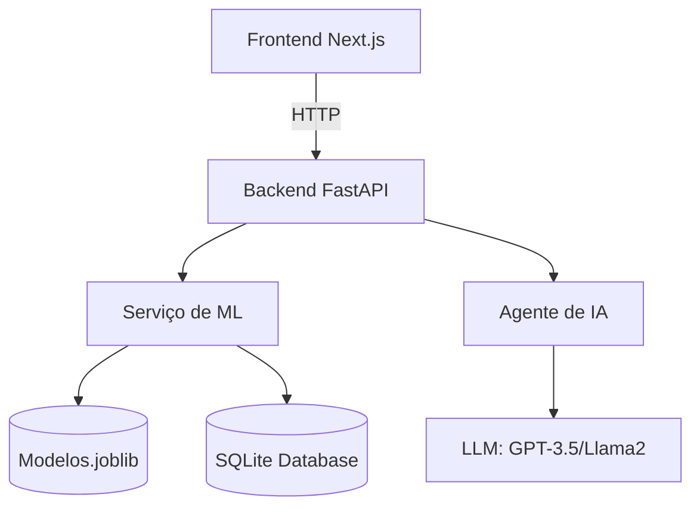
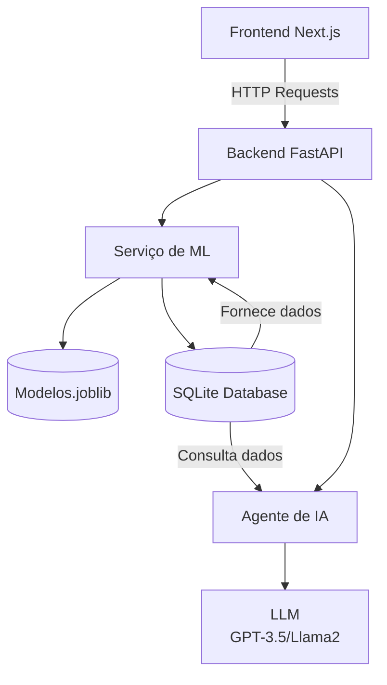

# ProdWise

 *(adicione seu logo depois)*

**Plataforma de análise preditiva com IA para tomada de decisões baseada em dados”**  
Integra análise de dados, modelos de Machine Learning e assistente conversacional para insights empresariais.

---

## 🚀 **Principais Funcionalidades**
- **Upload e Visualização de Dados**: Suporte a CSV, Excel e conexões SQL
- **Modelos Preditivos**: Treinamento e inferência em tempo real
- **Assistente de IA**: Explicações naturais sobre previsões
- **Dashboard Interativo**: Gráficos dinâmicos e filtros avançados

---

## 🛠 **Arquitetura Técnica Simplificada**

## 🛠 **Arquitetura Técnica Explicada**

## 🏗️**Estruturação de pastas**
```
ProdWise/
├── app/
│   ├── __init__.py
│   ├── core/
│   │   ├── config.py       # Configurações globais
│   │   └── database.py     # Conexão com DB (SQLAlchemy)
│   ├── models/
│   │   ├── __init__.py
│   │   ├── base.py         # Modelos base
│   │   └── dados.py        # Modelos de dados
│   ├── routes/
│   │   ├── __init__.py
│   │   ├── api.py          # Endpoints FastAPI
│   │   └── views.py        # Templates (se houver front)
│   ├── services/
│   │   ├── __init__.py
│   │   ├── data_service.py # Lógica de dados
│   │   └── ml_service.py   # Serviços de ML
│   └── main.py             # App FastAPI principal
│
├── frontend/                 # Next.js
│   ├── public/               # Arquivos estáticos
│   ├── src/
│   │   ├── app/              # Roteamento (App Router)
│   │   │   ├── (dashboard)   # Grupo de rotas
│   │   │   │   ├── page.tsx  # Página principal
│   │   │   │   └── layout.tsx
│   │   ├── components/       # Componentes reutilizáveis
│   │   ├── lib/              # Utilitários/API calls
│   │   ├── styles/           # CSS global
│   │   └── types/            # Tipos TypeScript
│   ├── next.config.js        # Configuração Next
│   ├── package.json
│   └── tsconfig.json
│
├── data/
│   ├── database.db        
│   └── base.csv
│
├── scripts/
│   └── import_csv.py    
│   
│
├── tests/                  # Testes automatizados
│   ├── unit/
│   └── integration/
│
├── infrastructure/
│   ├── Dockerfile
│   └── docker-compose.yml
│
├── requirements/
│   └── base.txt            # Dependências principais
│
├── .env.example            # Template de variáveis
├── .gitignore
├── LICENSE
└── README.md
```